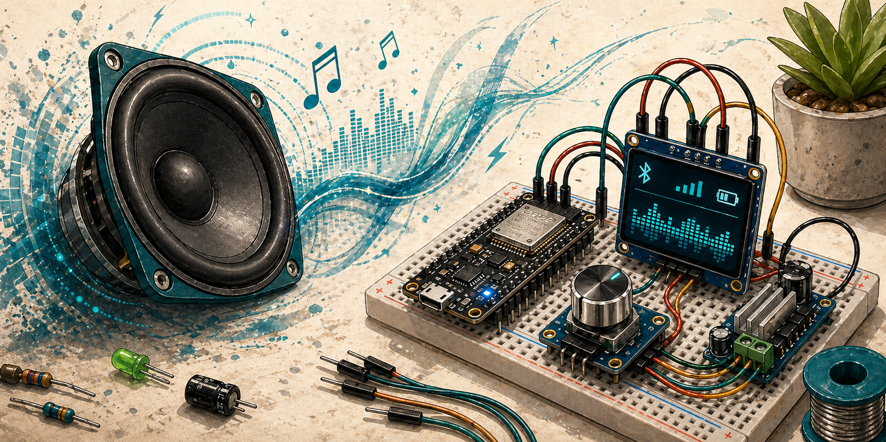

Bluetooth reproduktor. Co k tomu víc říct? Zvuk pravděpodobně nebude stát za moc, ale bude mít displej a potenciometr na ovládání hlasitosti.

## Komponenty

- mikrokontrolér s Bluetooth
- audio zesilovač
- reproduktor
- displej
- potenciometr nebo rotační enkodér

## Zapojení

TBD

## Zdroje

TBD

## Poznámky

TBD
