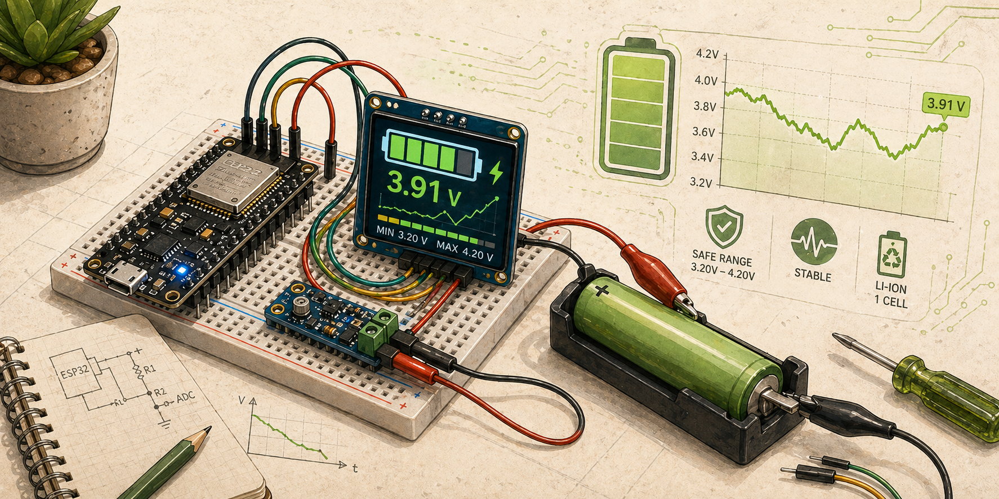

Měří napětí připojené baterie a zobrazuje zbývající kapacitu v procentech na displeji.

## Komponenty

- mikrokontrolér
- měřicí vstup pro napětí
- OLED displej
- konektor nebo svorky pro baterii
- tlačítko

## Zapojení

TBD

## Zdroje

TBD

## Poznámky

TBD
