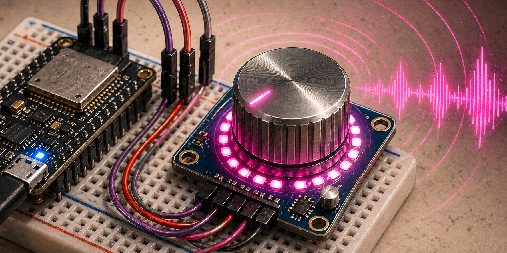

Fyzický ovladač hlasitosti pro PC nebo telefon. Otáčením potenciometru se mění systémová hlasitost. Displej ukazuje aktuální hlasitost v procentech a indikátor připojení. Funguje přes Bluetooth nebo USB.

## Komponenty

- mikrokontrolér s USB nebo Bluetooth
- potenciometr nebo rotační enkodér
- OLED displej

## Zapojení

TBD

## Zdroje

TBD

## Poznámky

TBD
