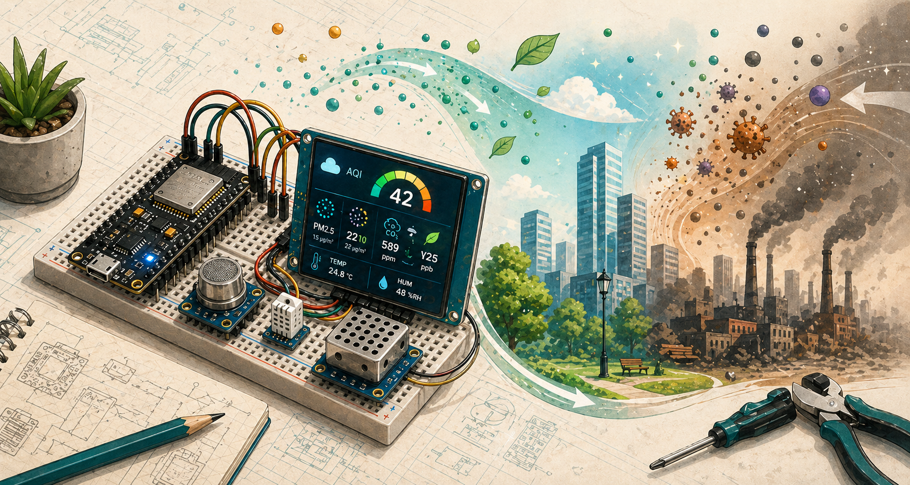
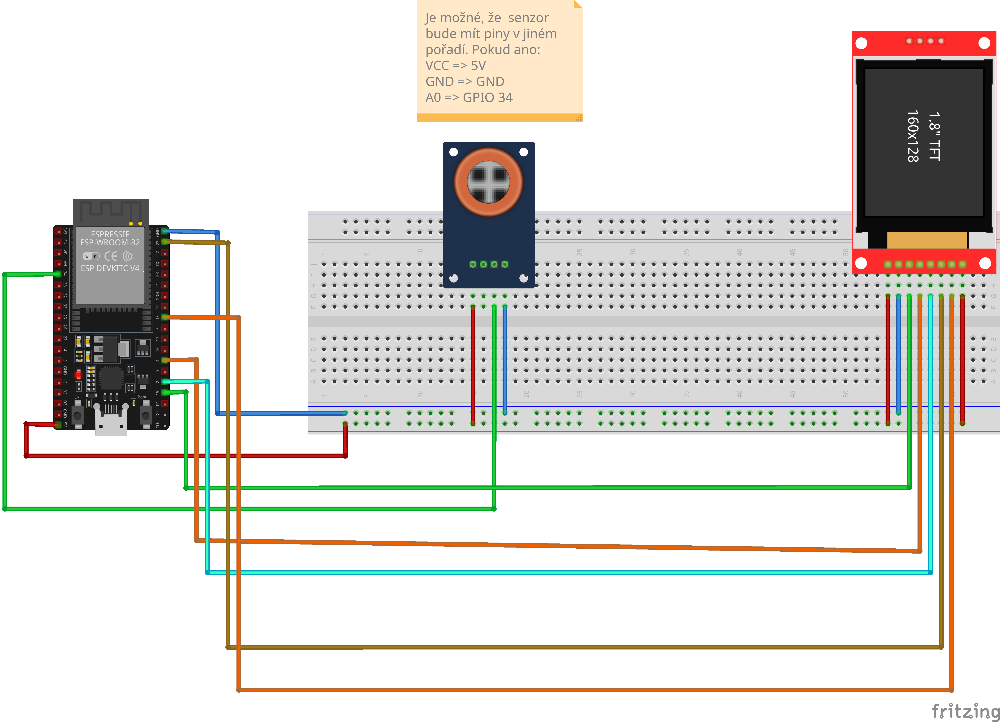
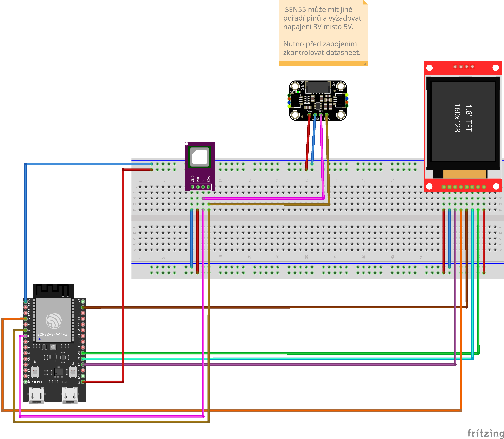

Měří kvalitu vzduchu a zobrazuje hodnoty $CO_2$, VOC nebo AQI indexu na displeji.

## Komponenty

- mikrokontrolér
- senzor kvality vzduchu
- OLED nebo TFT displej

## Zapojení

TBD

## Zapojení 2

## Zdroje

TBD

## Poznámky

TBD
