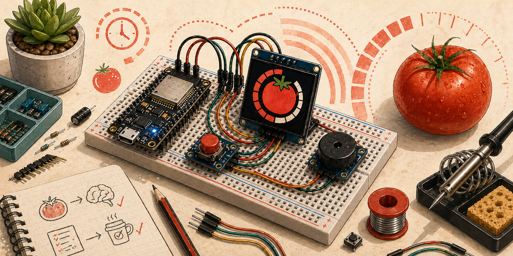
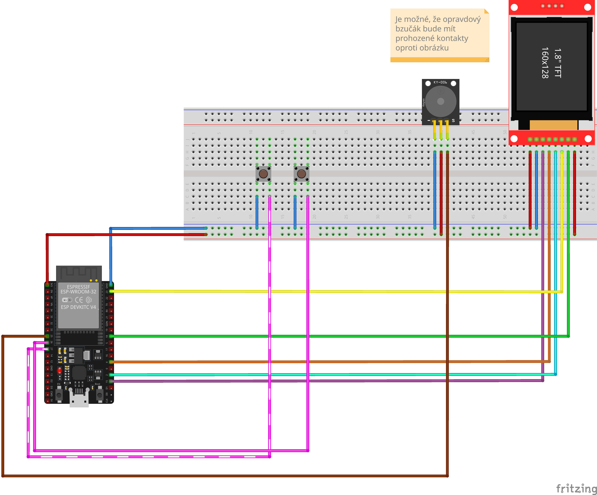

Odpočítává pracovní bloky a přestávky. Pípne a zobrazí notifikaci při změně fáze.

## Komponenty

- mikrokontrolér
- displej
- tlačítka
- piezo bzučák
- LED dioda nebo LED kroužek

## Zapojení

TBD

## Zdroje

TBD

## Poznámky

TBD
