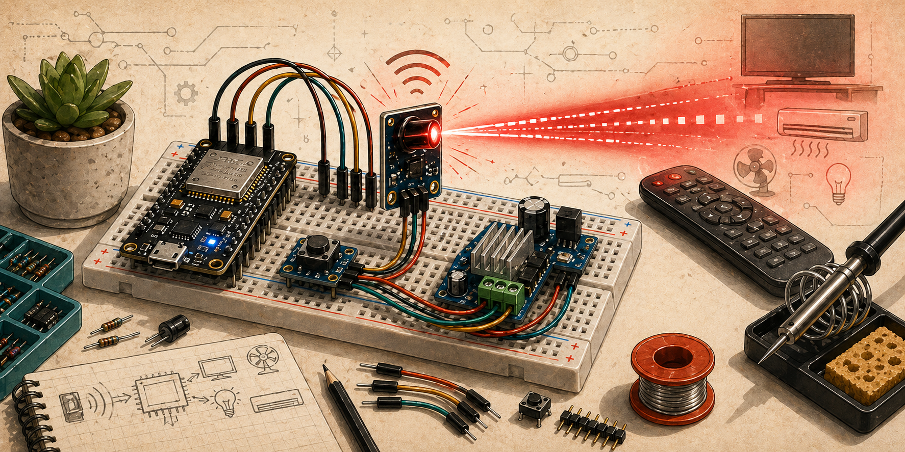
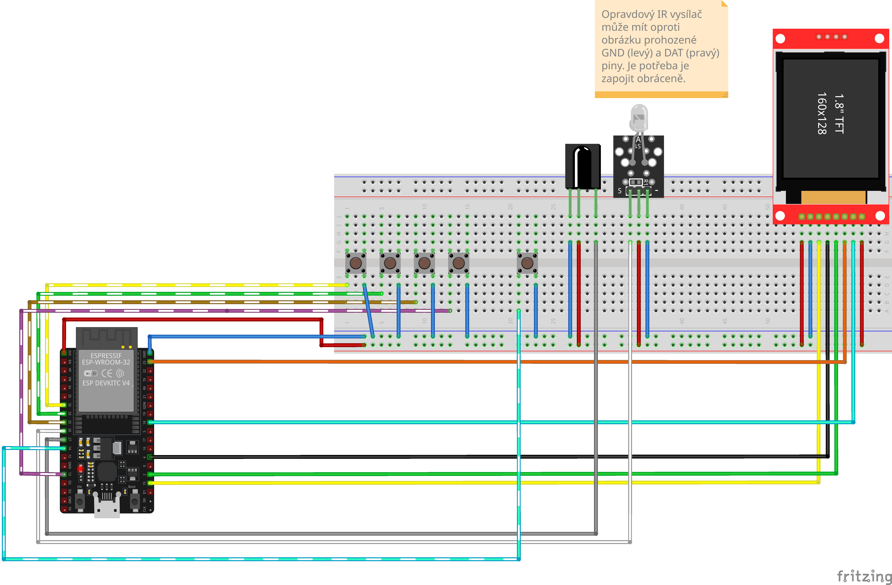

Univerzální IR ovladač s možností nahrávání a přehrávání signálů. Každé tlačítko ukládá jeden IR signál – podržením tlačítka se aktivuje režim nahrávání (čeká na příchozí IR signál z originálního ovladače), krátkým stiskem se uložený signál odešle. Signály jsou organizovány do bank – dedikované tlačítko cykluje mezi bankami, každá banka má vlastní sadu nahraných signálů. Aktuálně zvolená banka se zobrazuje na displeji.

## Komponenty

- mikrokontrolér
- IR přijímač
- IR LED vysílač
- tlačítka
- displej

## Zapojení

TBD

## Zdroje

TBD

## Poznámky

TBD
