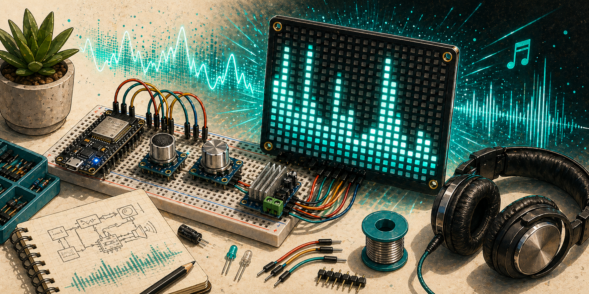
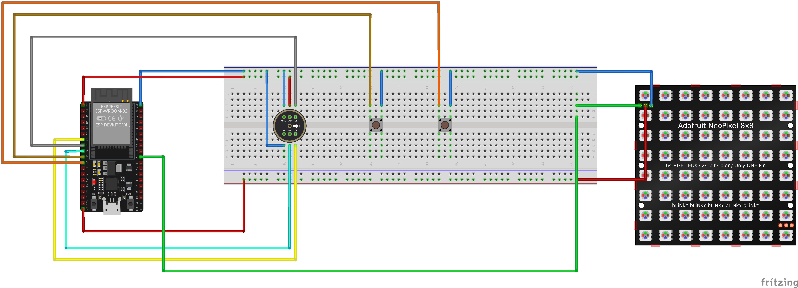

Mikrofon snímá hlasitost a zobrazuje ekvalizér na LED matici. Reaguje na hudbu, tleskání nebo hlas.

## Komponenty

- mikrokontrolér
- mikrofonní modul
- LED matice nebo LED pásek

## Zapojení

TBD

## Zdroje

TBD

## Poznámky

TBD
