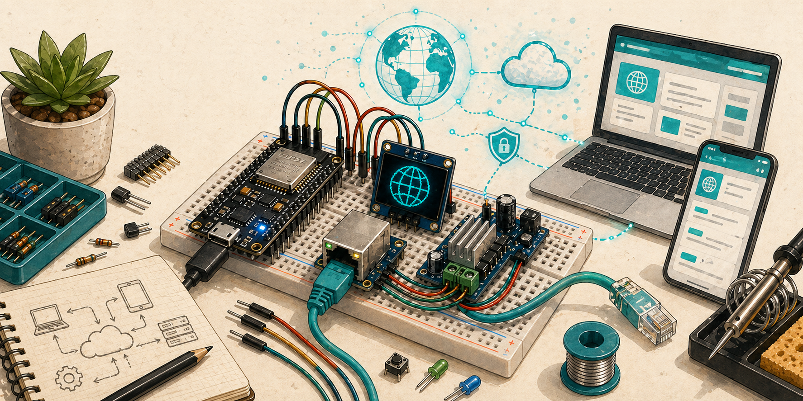
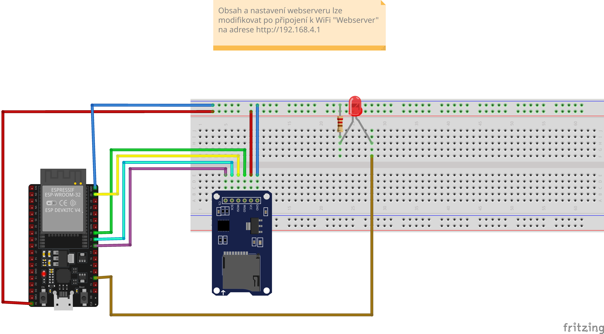

Hostuje jednoduchou webovou stránku přístupnou přes lokální síť. Umožňuje nahrání a modifikaci obsahu.

## Komponenty

- mikrokontrolér s Wi-Fi
- Slot na SD kartu

## Zapojení

TBD

## Zdroje

- https://github.com/Tech1k/helloesp

## Poznámky

TBD
